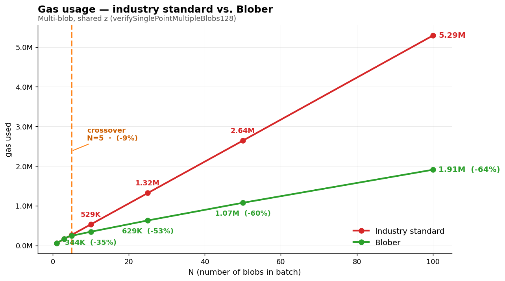
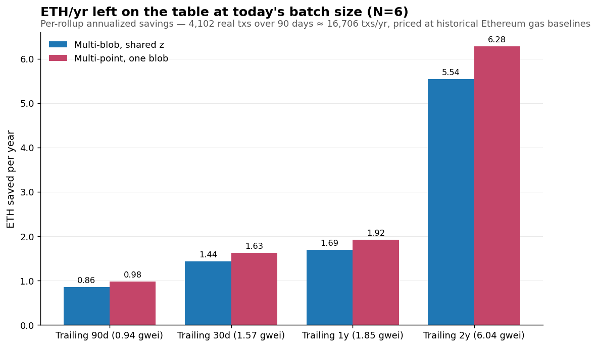

# blob-verifier

A Solidity library for **batched KZG proof verification** using EIP-2537 BLS12-381 precompiles, as a drop-in alternative to looping the EIP-4844 `0x0A` point-evaluation precompile per blob.

One pairing check across N openings, instead of N independent calls.

## The result




- **Crossover at N=5.** Below the crossover, we threshold-fall back to `0x0A` so we're never worse than the standard.
- **~66% gas saved** at N=200 (multi-blob shared z); **~71%** for the multi-point case (single blob, N openings).
- **Real mainnet replay** (4,102 production txs over 90 days) yields **0.172 ETH saved** at observed gas. Projected **104 ETH/yr per rollup** if batches grow to N=100; **3,548 ETH/yr** at N=1000 with trailing-2y gas. Full receipts in [`benchmarks/RESULTS.md`](benchmarks/RESULTS.md).

## What's the difference

What every EIP-4844 rollup does today (one `0x0A` call per blob):

```solidity
for (uint256 i; i < n; ++i) {
    bytes memory input = abi.encodePacked(
        blobHashes[i], z, ys[i], commitments[i], proofs[i]
    );
    (bool ok, ) = address(0x0A).staticcall(input);
    require(ok, "kzg fail");
}
```

What `blob-verifier` exposes (one batched call):

```solidity
import { BlobVerifier } from "blob-verifier/BlobVerifier.sol";

BlobVerifier.verifySinglePointMultipleBlobs128(
    blobHashes, z, ys, commitments, proofs
);
// Reverts on bad proof. Threshold-falls back to 0x0A when N < 5.
```

The 128-byte commitments/proofs are EIP-2537 uncompressed G1 encoding. We provide compress/decompress helpers in `src/Bls12381.sol` for migrating from the 48-byte format.

## What's in the box

| Function | Use case |
|---|---|
| `verifySinglePointMultipleBlobs128` | N blobs, one shared opening point `z` (most rollups) |
| `verifyMultiplePoints128` | Single blob, N distinct opening points (DA recovery) |
| `verifySinglePoint` (48-byte and 128-byte) | Single-blob, single-point — equivalent to a direct `0x0A` call |

Both batched verifiers automatically fall back to the `0x0A` loop when `N < 5` (below the crossover), so you get the best of both worlds without any branching at the call site.

## Quick start

```bash
forge install
forge test                        # 44 tests, all green
```

To regenerate the benchmark data:

```bash
cd benchmarks/scripts && npm install
npm run generate                  # KZG fixtures (real c-kzg)
cd .. && forge test -vv           # synthetic gas curves
cd scripts && npm run replay      # 90-day mainnet replay
```

See [`benchmarks/README.md`](benchmarks/README.md) for the demo narrative and [`benchmarks/RESULTS.md`](benchmarks/RESULTS.md) for the full numbers and methodology.

## Math (briefly)

For N blob openings $(C_i, z, y_i, \pi_i)$ at a shared point $z$, with Fiat-Shamir random weights $r_i$:

$$
\text{LHS} = \sum r_i C_i + z \cdot \text{RHS} - \left(\sum r_i y_i\right) G_1
\qquad
\text{RHS} = \sum r_i \pi_i
$$

We then assert $e(\text{LHS}, -G_2) \cdot e(\text{RHS}, [s] G_2) = 1$ via a single `PAIRING_CHECK` (0x0F) call. The shared $z$ lets us factor it out, shrinking the LHS multi-scalar multiplication from $2N+1$ slots to $N+2$.

The mainnet trusted setup $[s]G_2$ is hard-coded as a constant (decompressed once from the ceremony output).

## Tooling

- Foundry with `via_ir = true`, `evm_version = "osaka"` (for EIP-2537 + EIP-5656 mcopy)
- TypeScript / `tsx` for off-chain fixture generation (real `c-kzg` bindings) and mainnet replay
- No API keys required — replay uses Blockscout (free, no auth) + a public Ethereum RPC
