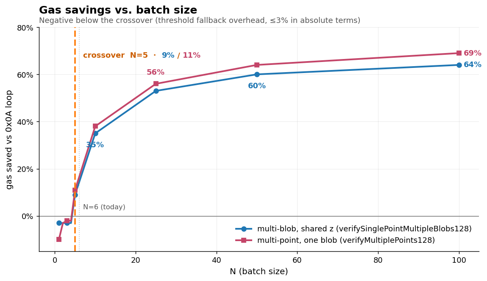
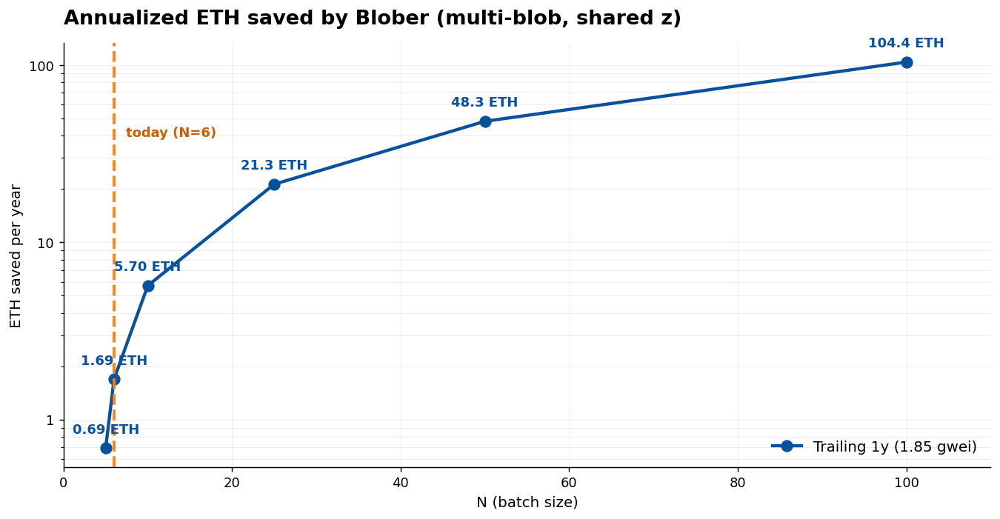

## Blober - On-chain Blob Verification Library in Solidity 
**Blober** is a Solidity library for Ethereum blob verification (and more), by introducing a well designed set of blob point verification flows it eases helps the L2 settlements. 

---
### Problem Solution
So far L2s usually build their own blob verification flows, in a non-standardized and sometimes messy way, Blober serves as a library that abstracts away the precompile interactions and makes the verification clean and efficient.

Blober's special feature is in multi-point verifications, across multiple blobs, where by utilizing the BLS precompiles from EIP-2537 it merges the blob points into a single point, making a verification process of multiple points less costly (by much).

Blober also contains other utils that can help you checksum the specific blob hash, get a versioned hash from the blob data hash, check if blob is present in the tx and more! 

With introduction of 21 blob per block limit, Blober multi-point verification becomes increasingly effective, for L2s using Blober instead of iterative point validation, gas consumption can be reduced by up to **80%**!

Danksharding and Block-in-Blob EIPs can further leverage usage of Blober, potentially requiring the development of new features.

---
### Build
```
$ forge build
```

### Test
```
$ forge test --fork-url <ETH_RPC>
```

---
### Usage

#### Install
```
$ forge install markolazic01/blob-verifier
```
#### Import
``` solidity
pragma solidity ^0.8.30;

import { BlobVerifier } from "blob-verifier/BlobVerifier.sol";
```

---
### License
MIT


---
## Benchmarking results

Done on commit: d6c03fd0a01cdcf6f6a7f102ecc94a729c0c94d7

Side-by-side measurement of `BlobVerifier`'s EIP-2537 batched KZG verifiers vs the industry-standard EIP-4844 0x0A-loop pattern, plus a real-mainnet replay grounding the comparison in production traffic.

## Headline

- **Below the crossover (N=1–4), Blober is ≤3% worse than the standard** (just threshold-fallback wrapper overhead — multi-point N=1 is a worst case at −10%). Above N=5, savings flip positive and grow rapidly.
- **Asymptotic savings at scale**: ~64% (multi-blob shared-z) and ~69% (multi-point single-blob) at N=100, measured against synthetic gas curves.
- **Real mainnet replay** (90-day window): 4,102 KZG state-update txs from a representative production rollup contract, all at N=6, totalling 223.9M gas saved (~0.172 ETH at observed gas).
- **Projected annualized savings**: 1.69 ETH/yr per rollup at today's behavior + trailing-1y gas; **104 ETH/yr per rollup if batches grow to N=100**; **341 ETH/yr** at N=100 + trailing-2y gas (bull-market baseline).

All numbers are reproducible from the artifacts in `benchmarks/data/` (commands at the bottom).




## Synthetic benchmark — gas vs N

Two test scenarios, both measured by Foundry against real EIP-2537 / EIP-4844 precompiles on `evm_version = "osaka"`. Reference verifier is `LoopVerifier.sol` — a stripped port of the industry-standard `verifyKzgProofs` loop without protocol-specific overhead (governance, state transitions, fact registration), so it represents the *best-case* baseline.

### Multi-blob, shared z (`verifySinglePointMultipleBlobs128`)

`benchmarks/data/synthetic_gas_multi_blob_one_point.csv`

| N | Industry-standard gas | Blober gas | Blober / Industry | Saved % |
|---|---|---|---|---|
| 1 | 57,380 | 59,159 | 103% | −3% |
| 2 | 107,550 | 110,876 | 103% | −3% |
| 3 | 160,232 | 165,100 | 103% | −3% |
| 4 | 212,929 | 219,364 | 103% | −3% |
| **5** | 265,646 | 243,257 | 91% | **+9%** ← crossover |
| 10 | 529,190 | 344,358 | 65% | 35% |
| 25 | 1,320,362 | 629,158 | 47% | 53% |
| 50 | 2,641,262 | 1,074,528 | 40% | 60% |
| 100 | 5,291,111 | 1,907,717 | 36% | 64% |
| 200 | 10,649,222 | 3,666,743 | 34% | **66%** ← peak |
| 500 | 27,198,624 | 9,573,892 | 35% | 65% |
| 1000 | 56,057,254 | 20,899,722 | 37% | 63% |

The negative percentages at N=1–4 are the threshold-fallback overhead: Blober dispatches to the `0x0A` loop below N=5 (so it's never *worse* than the standard in absolute terms), but pays a small wrapper cost (compress 128→48-byte commitments before the call).

### Multi-point, one blob (`verifyMultiplePoints128`)


`benchmarks/data/synthetic_gas_multi_point_one_blob.csv`

| N | Industry-standard gas | Blober gas | Blober / Industry | Saved % |
|---|---|---|---|---|
| 1 | 63,250 | 69,665 | 110% | −10% |
| 2 | 106,656 | 110,134 | 103% | −3% |
| 3 | 158,569 | 163,078 | 102% | −2% |
| 4 | 210,487 | 216,025 | 102% | −2% |
| **5** | 262,416 | 234,151 | 89% | **+11%** ← crossover |
| 10 | 522,025 | 323,781 | 62% | 38% |
| 25 | 1,301,072 | 573,540 | 44% | 56% |
| 50 | 2,600,393 | 958,304 | 36% | 64% |
| 100 | 5,202,220 | 1,662,229 | 31% | 69% |
| 200 | 10,427,324 | 3,122,896 | 29% | **71%** ← peak |
| 500 | 26,275,367 | 7,810,809 | 29% | 71% |
| 1000 | 53,162,294 | 16,112,844 | 30% | 70% |

Multi-point peaks higher than multi-blob because the LHS has a *single shared commitment slot* (with weight `Σr_i`) instead of N separate commitment slots. Structural advantage from the math, not from extra optimization.

## Mainnet replay — 90 days of real txs

`benchmarks/data/reference_replay.json` — generated by `npm run replay`.

We sampled all `updateStateKzgDA` calls to a representative production rollup contract (proxy `0xc662c410…`) over the trailing 90 days.

| Metric | Value |
|---|---|
| Sample size | **4,102 txs** |
| Time window | **~89.6 days** (~1.9 txs/hour) |
| Blobs per tx | 6 (every tx) |
| Observed gas price | median 1.03 gwei, range 0.07–9.96 gwei |
| **Total gas saved** | **223,860,777** |
| **Total ETH saved** *(at the actual gas prices each tx paid)* | **0.172 ETH** |
| Per-tx saved | 54,574 gas / 0.000042 ETH |
| Annualized rate (assuming traffic continues) | **16,706 txs/yr** |

**Why the absolute ETH is modest**: the rollup currently posts at the EIP-4844 cap of N=6 (just past our crossover, where savings sit at ~17%), and the 90-day window covers a historically depressed gas-price regime (median ~1 gwei). The savings *percentage* is structural; the absolute amount scales with gas price. See the cost matrices below for projections at non-anomalous baselines.

## Annualized cost matrices

Per-tx cost projections held against historical Ethereum daily-average gas prices (`benchmarks/data/avg_gas_price_daily.csv`, Etherscan export 2015–2026), times the observed traffic rate (16,706 txs/yr).

### Historical baselines

| Window | Avg gwei | Why this matters |
|---|---|---|
| Trailing 30d | 1.57 | Recent typical activity |
| Trailing 90d | 0.94 | Captures depressed-gas regime |
| **Trailing 1y** | **1.85** | Most defensible "today's typical" baseline |
| **Trailing 2y** | **6.04** | Captures broader activity-cycle baseline |

(Note: trailing 5y averages ~32 gwei because it includes 2020–2022 bull-market peaks. We dropped that window — it's not representative of forward-looking conditions.)

### Multi-blob, shared z — annualized ETH saved (16,706 txs/yr)

`benchmarks/data/reference_replay.json → costMatrix.multiBlob.rows[i].perYear[baseline].saved`

Tables capped at N=100 (per the hypothesis range we want to defend; the synthetic gas tables above include N=200/500/1000 measurements you can extrapolate from).

| N | 30d (1.57) | 90d (0.94) | **1y (1.85)** | **2y (6.04)** |
|---|---|---|---|---|
| 1 | −0.05 | −0.03 | −0.05 | −0.18 |
| 2 | −0.09 | −0.05 | −0.10 | −0.34 |
| 3 | −0.13 | −0.08 | −0.15 | −0.49 |
| 4 | −0.17 | −0.10 | −0.20 | −0.65 |
| 5 | 0.59 | 0.35 | 0.69 | 2.26 |
| **6** *(today)* | **1.44** | **0.86** | **1.69** | **5.54** |
| 10 | 4.84 | 2.90 | 5.70 | 18.65 |
| 25 | 18.10 | 10.84 | 21.33 | 69.74 |
| 50 | 41.02 | 24.57 | 48.35 | 158.07 |
| **100** | **88.58** | **53.05** | **104.40** | **341.36** |

### Multi-point, one blob — annualized ETH saved (same traffic assumption)

`benchmarks/data/reference_replay.json → costMatrix.multiPoint.rows[i].perYear[baseline].saved`

| N | 30d (1.57) | 90d (0.94) | **1y (1.85)** | **2y (6.04)** |
|---|---|---|---|---|
| 1 | −0.17 | −0.10 | −0.20 | −0.65 |
| 2 | −0.09 | −0.05 | −0.11 | −0.35 |
| 3 | −0.12 | −0.07 | −0.14 | −0.46 |
| 4 | −0.15 | −0.09 | −0.17 | −0.56 |
| 5 | 0.74 | 0.44 | 0.87 | 2.85 |
| **6** *(today)* | **1.63** | **0.98** | **1.92** | **6.28** |
| 10 | 5.19 | 3.11 | 6.12 | 20.00 |
| 25 | 19.05 | 11.41 | 22.45 | 73.40 |
| 50 | 42.99 | 25.75 | 50.67 | 165.67 |
| **100** | **92.68** | **55.51** | **109.24** | **357.16** |

### Visualizations




> **N capped at 100** in both charts. Per-rollup, same observed traffic rate (16,706 txs/yr) across all rows.

### Demo-friendly chain of headlines

- *"At today's rollup behavior (N=6) and trailing-1y gas, we save **1.69 ETH/yr per rollup**, grounded in 90 days of real mainnet activity."*
- *"If protocols allow N=100 batches, savings hit **~104 ETH/yr per rollup** — 62× the current case."*
- *"At trailing-2y gas baselines (6 gwei) and N=100, savings hit **~341 ETH/yr per rollup** — projected bull-market savings."*
- *"Multi-point use cases save consistently more than multi-blob (~71% vs ~66% asymptote) — structural advantage from the LHS slot reduction."*

## Methodology + caveats

We've tried to be rigorous about what we measured vs. what we extrapolated. Honest caveats matter for credibility:

### What we directly measured

- **Synthetic gas curves**: Foundry tests on identical inputs (`fixtures_multi_blob.json`, `fixtures_multi_point.json`), measuring `gasleft()` before/after external calls to two contracts (`LoopVerifier`, our `BatchedVerifier` harness around `BlobVerifier`).
- **Real tx blob counts and gas prices**: pulled from public RPC + Blockscout for the actual contract over a 90-day window — 4,102 txs.

### What we extrapolated / assumed

- **Linear interpolation for off-grid N**: the cost matrix uses linear interpolation between measured benchmark points. We measured directly up to N=1000 — the matrix is interpolation-only inside that range, not extrapolation.
- **Hypothetical N values vs current Ethereum constraints**: N=200/500/1000 rows assume protocol-level changes (current EIP-4844 caps blobs/tx at ~9). The math works; the *opportunity* is gated on protocol evolution.
- **Single-contract sample**: we replayed one rollup. Other rollups using KZG verification have different patterns. Ecosystem-wide impact is bigger but harder to defend without per-rollup data.
- **Verification-slice savings, not whole-tx savings**: we compare *the verification portion* of gas. Real txs also pay for state-update logic, message processing, etc. — savings here don't reduce those.
- **Daily-average gas underestimate**: state-update txs typically pay above-average gas for inclusion priority. Our cost projections at historical baselines are likely *conservative*.
- **Reference loop is a stripped port**: `LoopVerifier.sol` strips Starknet-specific overhead (program-output parsing, fact registration). Real production loops are slower than our reference, so our savings are an *underestimate* of what a real swap-in would yield.

### Measurement noise

- Foundry's `gasleft()` includes outer-call overhead (~21k intrinsic + calldata copy). Both verifiers are measured the same way, so comparison is fair, but absolute numbers include this fixed overhead.
- The N=1 row shows a slight negative (−3% multi-blob, −10% multi-point) because the threshold fallback path adds compress + 0x0A — slightly more work than calling 0x0A directly. The absolute amount is sub-milliETH and only matters for hypothetical N=1 calls. Real rollups always batch.

## Where the data lives

```
benchmarks/
├── data/
│   ├── fixtures_multi_blob.json                   ← 1000 random blobs at z=1 (input)
│   ├── fixtures_multi_point.json                  ← 1 blob at 1000 distinct z (input)
│   ├── synthetic_gas_multi_blob_one_point.csv     ← gas curve, regenerated by `forge test`
│   ├── synthetic_gas_multi_point_one_blob.csv     ← gas curve, regenerated by `forge test`
│   ├── avg_gas_price_daily.csv                    ← Etherscan historical export, 2015–2026
│   ├── reference_replay.json                      ← per-tx mainnet replay + cost matrices
│   └── chart_*.png                                ← generated by `scripts/generate_charts.py`
│
├── scripts/
│   ├── generate_fixtures.ts                       ← npm run generate
│   ├── fetch_reference_txs.ts                     ← npm run replay
│   └── generate_charts.py                         ← matplotlib chart regenerator
│
├── src/LoopVerifier.sol                           ← the comparison reference
├── test/Compare.t.sol                             ← side-by-side gas measurement harness
└── foundry.toml
```

## Reproducibility

From `benchmarks/scripts/`:

```bash
npm install            # one-time, installs c-kzg + @noble/curves + tsx
npm run generate       # regenerates fixtures_multi_blob.json + fixtures_multi_point.json (~50s)
```

From `benchmarks/`:

```bash
forge test -vv         # regenerates both synthetic_gas_*.csv (~5s)
```

From `benchmarks/scripts/`:

```bash
npm run replay         # regenerates reference_replay.json (~45s for 90-day window, ~4000 txs)
```

Configurable via env vars:

```bash
WINDOW_DAYS=90 MAX_SAMPLE=5000 RPC_CONCURRENCY=10 npm run replay
```

No API keys required. The replay uses Blockscout (free, no auth) for tx listing and a public Ethereum RPC for tx receipts.
